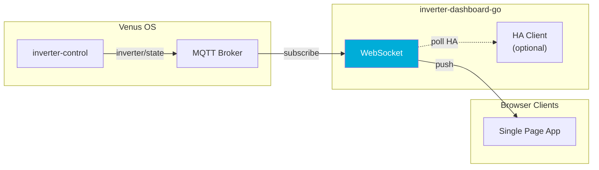
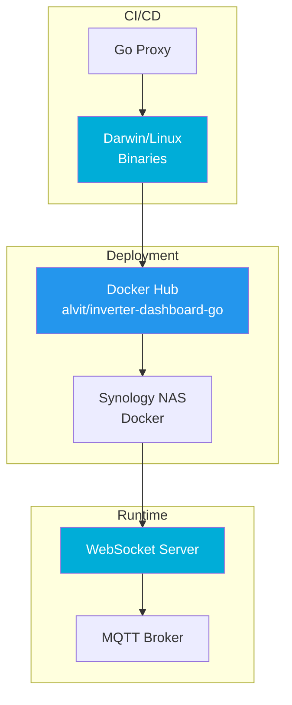

# System Architecture

## Data Flow



## Binary Deployment



## Runbook: Troubleshooting

### Docker Container Not Starting

**Symptoms:**
- Container exits immediately
- "exec format error"

**Actions:**
```bash
# Check architecture
uname -m
# Should match: amd64 or arm64

# Try specific tag
docker pull alvit/inverter-dashboard-go:amd64
docker run alvit/inverter-dashboard-go:amd64
```

### WebSocket Connection Issues

**Symptoms:**
- Dashboard shows connecting...
- WebSocket errors in browser console

**Actions:**
```bash
# Check MQTT connectivity from container
docker exec inverter-dashboard-go nc -zv MQTT_HOST 1883

# Verify binary is listening
docker exec inverter-dashboard-go ss -tlnp
```

### Out of Memory on NAS

**Symptoms:**
- Container OOM killed
- NAS alerts

**Actions:**
```bash
# Limit memory
docker run --memory=256m alvit/inverter-dashboard-go:latest

# Or in compose
services:
  dashboard:
    image: alvit/inverter-dashboard-go:latest
    mem_limit: 256m
```

---

## Related Documentation

- [inverter-control System Architecture](../inverter-control/.github/docs/system-architecture.md)
- [ADR-002: MQTT Bridge Architecture](../inverter-control/.github/docs/adr-001-grid-zero-architecture.md)
